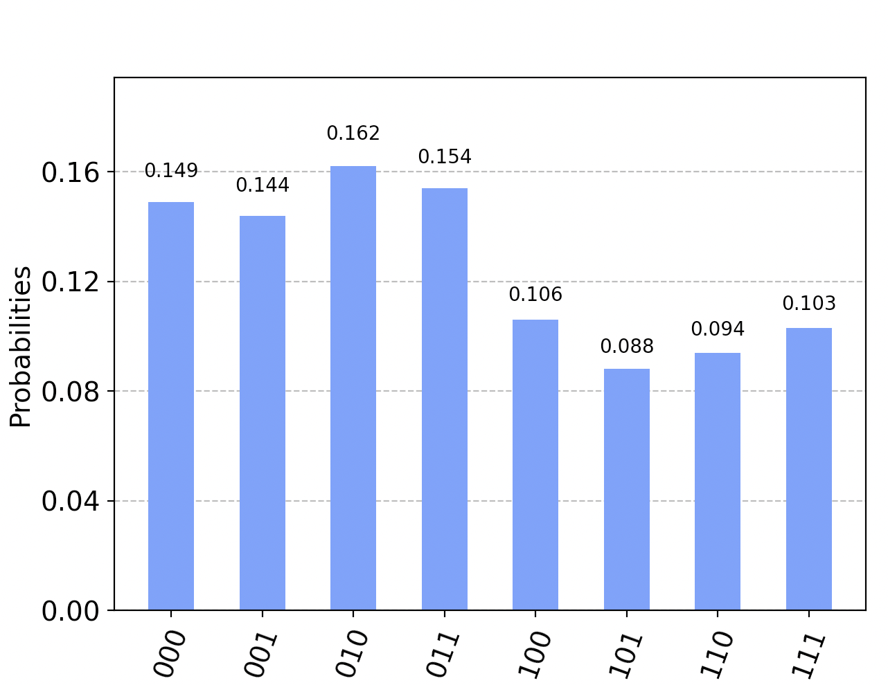

# Quantum Adder
This is some simple Qiskit code to add two two-bit numbers and get a three-bit result, in a way that can be run on a five qubit quantum computer or simulator. The current code adds 2 (0b10) and 3 (0b11) and should get 5 (0b101).

The adder is based on: [Thapliyal, Himanshu & Ranganathan, N. (2013). Design of Efficient Reversible Logic-Based Binary and BCD Adder Circuits. ACM Journal on Emerging Technologies in Computing Systems (JETC). 9. 10.1145/2491682.](https://www.researchgate.net/publication/262163558_Design_of_Efficient_Reversible_Logic-Based_Binary_and_BCD_Adder_Circuits)

## Getting started - on IBM Qiskit
To get this running, first install Qiskit
```
% pip3 install qiskit
```
and set up an account on [IBM Quantum](https://quantum-computing.ibm.com/). Also ensure you have [saved your API token](https://quantum-computing.ibm.com/lab/docs/iql/manage/account/ibmq).

## Getting startups - on AWS Braket
To get this running, first install AWS Braket
```
% pip3 install amazon-braket-sdk
```
and ensure you have already configured an AWS account and installed the [CLI tools](https://aws.amazon.com/getting-started/guides/setup-environment/module-three/).

## Running the code
There are two version of the code for each of Qiskit and Braket: 
1. `add.py` (or `add_aws.py`) runs the addition in the simulator
2. `addcloud.py` (or `addcloud_aws.py`) runs the addition in a cloud-based quantum computer (by default, on the five qubit Belem system on Qiskit or the 34 qubit SV1 simulator on Braket)
They all work the same way - just run them like this:
```
% python3 add.py
           ░                                          ░          
q_0: ──────░─────────────■──────────────■────■────────░──────────
     ┌───┐ ░           ┌─┴─┐          ┌─┴─┐  │        ░          
q_1: ┤ X ├─░───■────■──┤ X ├──■────■──┤ X ├──┼────■───░──────────
     ├───┤ ░   │    │  └─┬─┘  │    │  └─┬─┘┌─┴─┐  │   ░ ┌─┐      
q_2: ┤ X ├─░───┼────┼────■────┼────┼────■──┤ X ├──┼───░─┤M├──────
     ├───┤ ░ ┌─┴─┐  │         │  ┌─┴─┐     └───┘┌─┴─┐ ░ └╥┘┌─┐   
q_3: ┤ X ├─░─┤ X ├──┼─────────■──┤ X ├──────────┤ X ├─░──╫─┤M├───
     └───┘ ░ └───┘┌─┴─┐     ┌─┴─┐└───┘          └───┘ ░  ║ └╥┘┌─┐
q_4: ──────░──────┤ X ├─────┤ X ├─────────────────────░──╫──╫─┤M├
           ░      └───┘     └───┘                     ░  ║  ║ └╥┘
c: 3/════════════════════════════════════════════════════╩══╩══╩═
                                                         0  1  2 
Compiled circuit depth = 9

Total counts are: {'101': 1000}
```
You can see that it has run 1000 times, and every time it has come up with the right answer of 2 + 3, i.e. 5 (0b101).

The AWS Braket one looks a bit different, but essentially the same:
```
% python3 add_aws.py
T  : |0|1|2|3|4|5|6| 7 |

q0 : -------C-----C-C---
            |     | |
q1 : -X-C-C-X-C-C-X-|-C-
        | | | | | | | |
q2 : -X-|-|-C-|-|-C-X-|-
        | |   | |     |
q3 : -X-X-|---C-X-----X-
          |   |
q4 : -----X---X---------

T  : |0|1|2|3|4|5|6| 7 |
Compiled circuit depth =  8

Total counts are: {'101': 1000}
```

The `addcloud.py` (and `addcloud_aws.py`) version will take longer to run as it is executing on a real quantum computer somewhere, which might take a while if that quantum computer has a lot of compute jobs queued up. It will also return a range of counts due to the noise inherent in a real quantum computer, so the code will pop up a histogram at the end to make it easier to understand. The histogram from a real quantum computer will look something like this:

